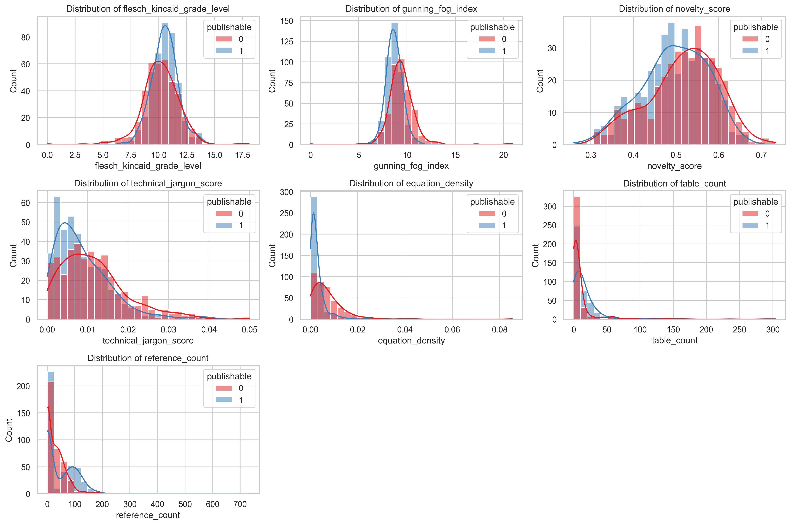
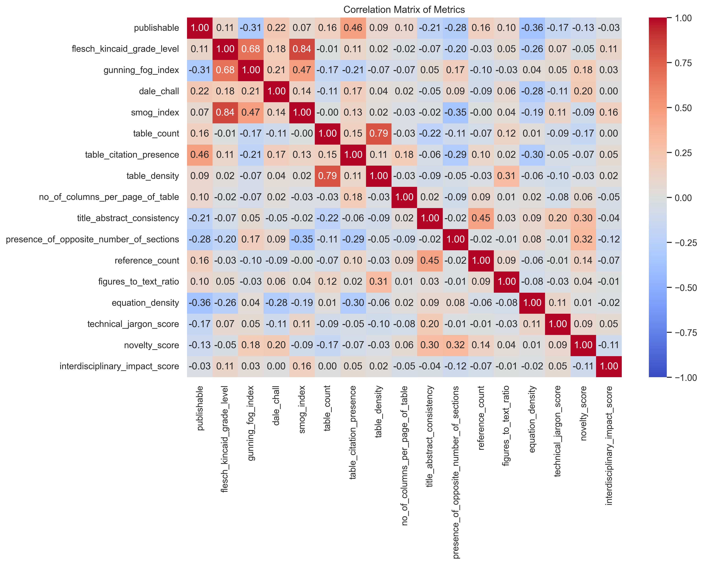
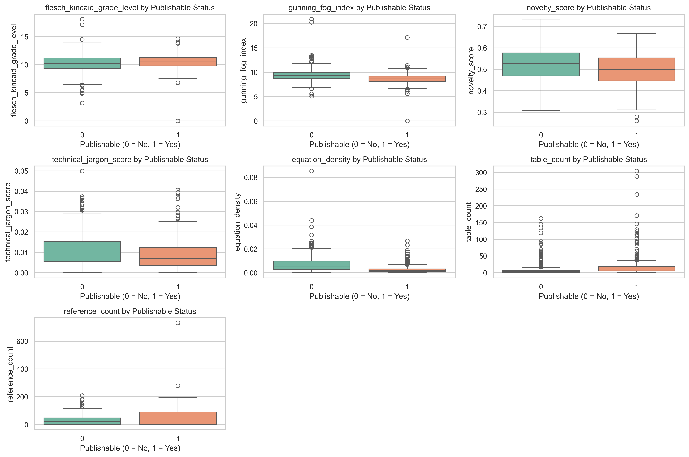
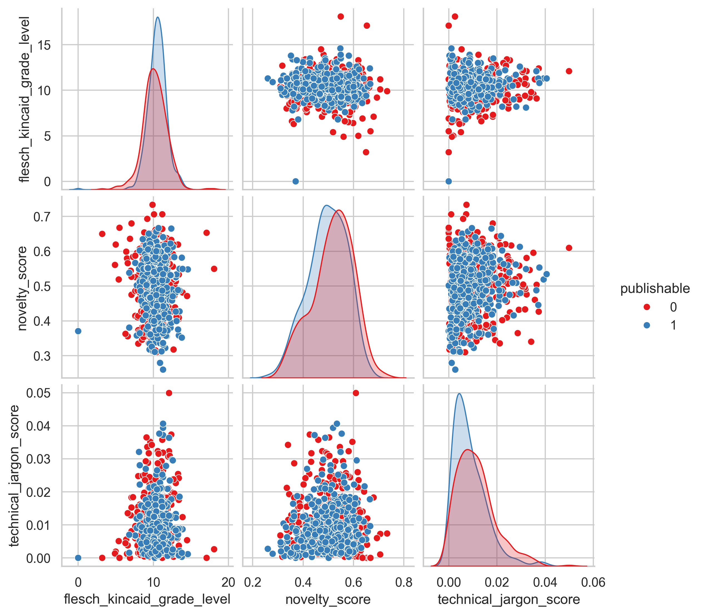
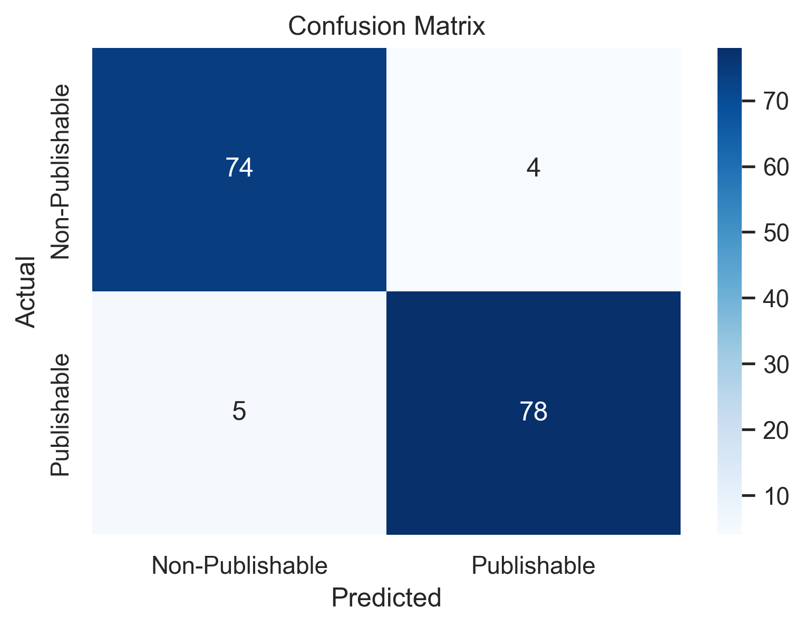
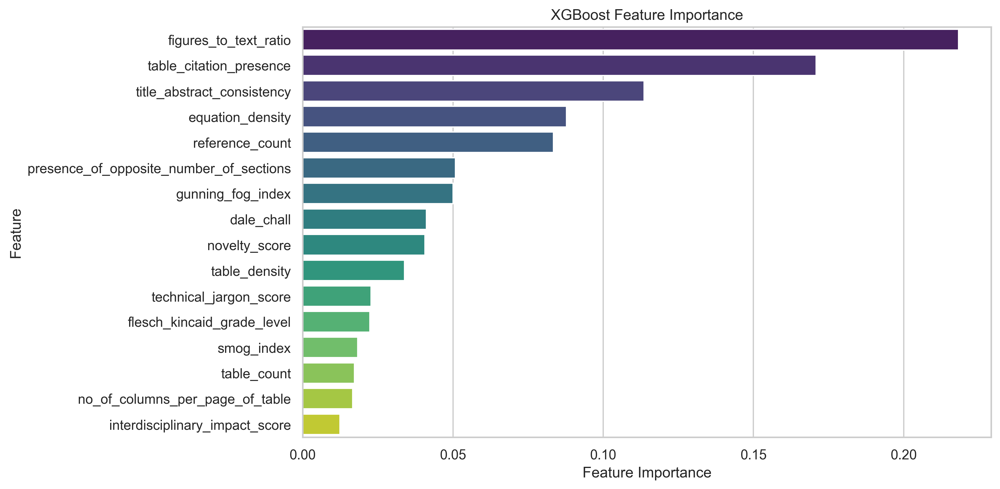

# AnalyzeX: Research Paper Classification System

## Project Overview

AnalyzeX is a data science project that develops a machine learning classifier to predict whether research papers are publishable based on various textual and structural features. The classifier analyzes academic papers and extracts features such as readability metrics, table/figure densities, citation patterns, and technical content characteristics to make publication quality predictions.

## Dataset

- **Total Papers**: 818 research papers
- **Publishable Papers**: 423 (51.7%)
- **Non-Publishable Papers**: 395 (48.3%)
- **Sources**: Papers from top conferences including NeurIPS 2022 and other academic venues

> **Note**: The original paper datasets are not included in this repository for certification and copyright reasons. The extracted features and processed data are available in the CSV files.

## Features Extracted

The model analyzes 16 key features from each paper:

### Readability Metrics
- **Flesch-Kincaid Grade Level**: Text complexity measurement
- **Gunning Fog Index**: Reading difficulty assessment
- **Dale-Chall Readability**: Vocabulary complexity
- **SMOG Index**: Simple Measure of Gobbledygook

### Structural Features
- **Table Count**: Number of tables in the paper
- **Table Density**: Tables per page ratio
- **Columns per Table Page**: Average table complexity
- **Figures to Text Ratio**: Visual content balance

### Content Quality Indicators
- **Equation Density**: Mathematical content concentration
- **Reference Count**: Citation thoroughness
- **Technical Jargon Score**: Domain-specific terminology usage
- **Citation Relevance**: Reference quality assessment

### Advanced Metrics
- **Title-Abstract Consistency**: Alignment between title and abstract
- **Novelty Score**: Innovation measurement
- **Interdisciplinary Impact Score**: Cross-field relevance
- **Section Structure Analysis**: Presence of standard academic sections

## Model Performance

### XGBoost Classifier Results
- **Test Set Accuracy**: 94.4%
- **Cross-Validation Accuracy**: 92.7% (± 2.5%)
- **Training Time**: 381.99 seconds

#### Classification Report
```
                 precision    recall  f1-score   support
Non-Publishable       0.94      0.95      0.94        78
    Publishable       0.95      0.94      0.95        83
       accuracy                           0.94       161
      macro avg       0.94      0.94      0.94       161
   weighted avg       0.94      0.94      0.94       161
```

### Feature Importance Rankings
1. **Figures to Text Ratio** (21.8%) - Most important predictor
2. **Table Citation Presence** (17.1%) - Reference integration quality
3. **Title-Abstract Consistency** (11.4%) - Content coherence
4. **Equation Density** (8.8%) - Mathematical rigor
5. **Reference Count** (8.3%) - Citation thoroughness

## Visualizations and Analysis

### Exploratory Data Analysis

#### Feature Distributions

*Distribution analysis showing the spread and patterns of key features across the dataset.*

#### Feature Correlation Matrix

*Heatmap revealing relationships and correlations between different paper features.*

#### Publishable vs Non-Publishable Comparison

*Comparative distributions between publishable and non-publishable papers for key metrics.*

#### Feature Relationships

*Pairwise feature relationships showing class separability and data patterns.*

### Model Performance Visualizations

#### Confusion Matrix

*XGBoost model performance showing prediction accuracy across classes.*

#### Feature Importance

*Ranking of features by their contribution to the classification model.*

## Project Structure

```
AnalyzeX/
├── README.md                          # This file
├── main.ipynb                         # Main analysis notebook
├── degrade.ipynb                      # PDF degradation preprocessing
├── paper_metrics.csv                  # Raw extracted features
├── preprocessed_paper_metrics.csv     # Cleaned dataset
├── xgb_model_results.txt             # Model performance metrics
├── eda_summary.txt                   # Statistical summary
├── eda_plots/                        # Exploratory data analysis
│   ├── distributions.png
│   ├── correlation_matrix.png
│   ├── boxplots.png
│   ├── pairplot.png
│   └── eda_summary.txt
├── confusion_matrix_xgb.png          # Model confusion matrix
├── feature_importance_xgb.png        # Feature importance plot
├── results.zip                       # Compressed results
├── chroma_db/                        # Vector database storage (ignored)
├── papers/                           # Source papers (ignored - not pushed)
├── non-publishable/                  # Degraded papers (ignored - not pushed)
└── myEnv/                           # Python virtual environment (ignored)
```

> **Note**: Directories marked as "ignored" are excluded from version control as specified in `.gitignore` for security, size, and certification reasons.

## Key Findings

### Publication Quality Indicators
1. **Visual Content Balance**: Papers with optimal figures-to-text ratios are more likely to be publishable
2. **Table Integration**: Proper citation and integration of tables strongly correlates with publication success
3. **Content Coherence**: Strong alignment between titles and abstracts indicates quality
4. **Mathematical Rigor**: Appropriate equation density suggests thorough methodology
5. **Citation Practices**: Comprehensive reference lists indicate scholarly rigor

### Feature Insights
- **Readability**: Publishable papers maintain moderate complexity (Grade Level ~10.3)
- **Structure**: Average of 13.1 tables per paper with 0.81 table density
- **Citations**: Reference counts vary widely (contributing 8.3% to prediction)
- **Technical Content**: Balanced jargon usage indicates expertise without obscurity

## Technical Implementation

### Libraries and Dependencies
- **Text Processing**: PyMuPDF, textstat, spaCy, NLTK
- **Machine Learning**: scikit-learn, XGBoost
- **NLP**: sentence-transformers, KeyBERT
- **Visualization**: matplotlib, seaborn
- **Data Handling**: pandas, numpy

### Model Configuration
- **Algorithm**: XGBoost Classifier
- **Hyperparameters**: 
  - `n_estimators`: 200
  - `max_depth`: 3
  - `learning_rate`: 0.1
  - `colsample_bytree`: 0.7
  - `subsample`: 1.0

## Usage

1. **Environment Setup**:
   ```bash
   pip install -r requirements.txt
   python -m spacy download en_core_web_sm
   ```

2. **Run Analysis**:
   - Open `main.ipynb` for complete analysis pipeline
   - Execute cells sequentially for feature extraction and model training

3. **View Results**:
   - Check `eda_plots/` for exploratory analysis
   - Review `xgb_model_results.txt` for detailed metrics
   - Examine confusion matrix and feature importance plots

## Future Improvements

1. **Feature Engineering**: Add semantic similarity metrics and citation network analysis
2. **Model Ensemble**: Combine multiple algorithms for improved robustness
3. **Deep Learning**: Implement transformer-based models for semantic understanding
4. **Real-time Prediction**: Deploy model as web service for live paper evaluation
5. **Expand Dataset**: Include papers from additional conferences and journals

## Results Summary

AnalyzeX successfully demonstrates that research paper publication quality can be predicted with **94.4% accuracy** using a combination of readability metrics, structural features, and content quality indicators. The model provides valuable insights into what makes a paper publishable, with visual content balance and table integration being the strongest predictors of publication success.

---

**Project**: AnalyzeX - Research Paper Classification System  
**Date**: June 2025  
**Model**: XGBoost Classifier  
**Performance**: 94.4% Test Accuracy
